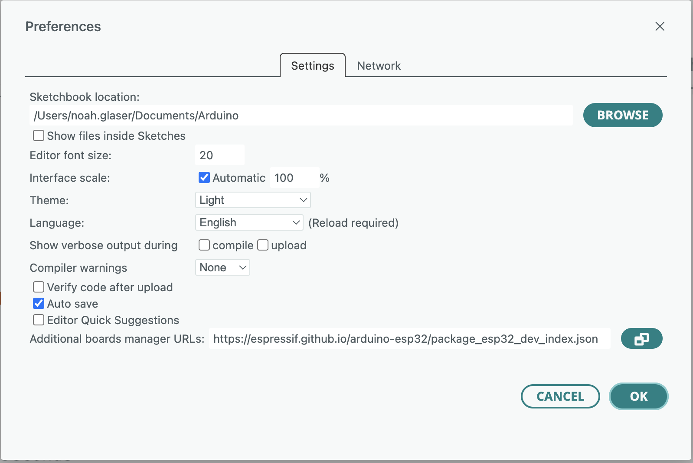
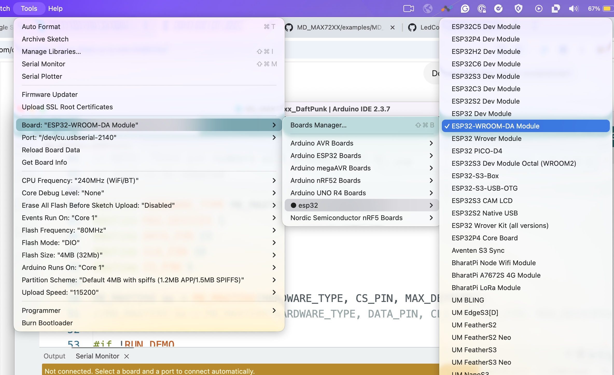

# LED Matrix + ESP32 Workshop

Get your LED matrix blinking, then remix some example animations.

## Wiring

| LED Matrix Pin | ESP32 Pin |
| -------------- | --------- |
| DIN (Data)     | GPIO 23   |
| CLK            | GPIO 18   |
| CS             | GPIO 5    |
| VCC            | 3.3V      |
| GND            | GND       |

⚠️ Double-check that **DIN goes to GPIO 23**. This is the most common wiring mistake.


---

## Arduino Setup

Install the [arduino ide](https://www.arduino.cc/en/software/) if you don't have it.

### 1) Install ESP32 board support

Open Arduino IDE 

Go to:

**Arduino IDE → Settings / Preferences**

Paste this URL into **Additional Boards Manager URLs**

```bash
https://raw.githubusercontent.com/espressif/arduino-esp32/gh-pages/package_esp32_index.json
```

---

### 2) Install Espressif boards

Go to:

**Tools → Board → Boards Manager**

Search for:

```bash
esp32
```

Install:

**esp32 by Espressif Systems**

---

### 3) Install LED Matrix library

Go to:

**Tools → Manage Libraries**

Search for:

```bash
MD_MAX72XX
```

Install:

**MD_MAX72XX by MajicDesigns**

---

## Open Example Code

Go to:

**File → Examples → MD_MAX72XX → Daft Punk**

---

## Update the Pins

Replace the pin section with:

```cpp
#define MAX_DEVICES 1
#define DATA_PIN 23
#define CLK_PIN 18
#define CS_PIN 5
```

---

## Select Your Board

Go to:

**Tools → Board**

Select:

**ESP32 WROOM-DA **



---

## Upload Settings

* **Tools → Flash Mode → DIO**
* **Tools → Upload Speed → 115200**

---

## Upload Your Code

Click the upload button.

If upload fails:

* Try another USB cable
* Make sure your port is selected
* Hold the **BOOT** button while uploading

---

# Free Play Challenges

## Easy

* Change the brightness
* Change the animation speed

## Medium

* Create your own smiley face
* Make custom pixel art

## Hard

* Build your own animation

## Boss Level

* Build a simple web server that controls your matrix

Have fun and break stuff 🙂
